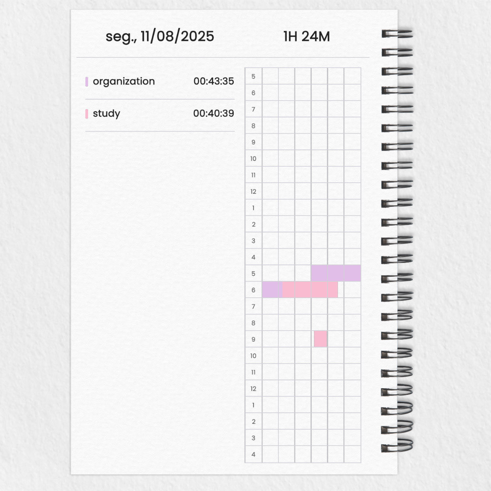
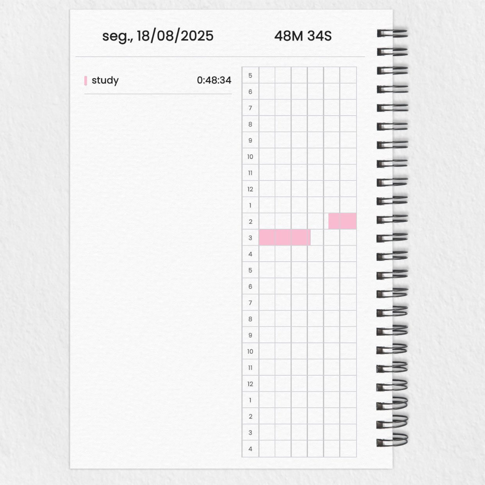
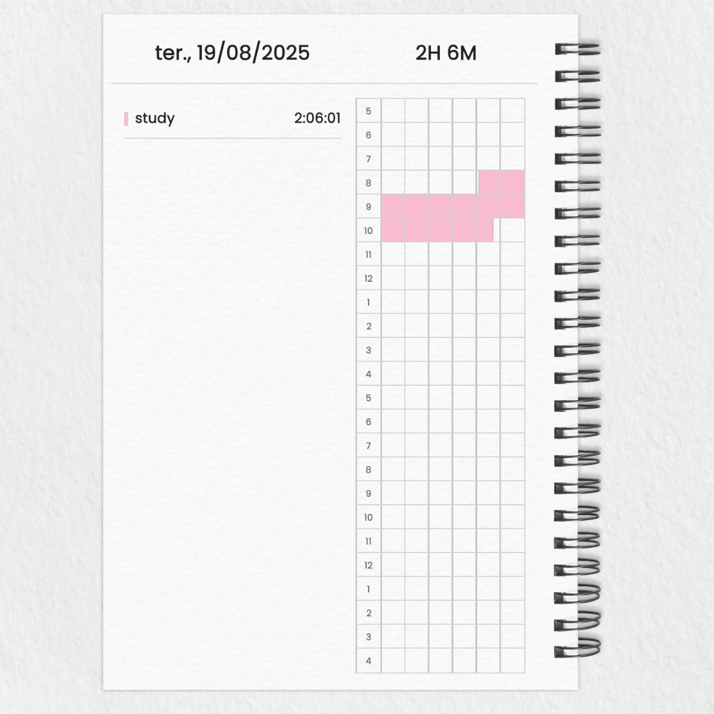
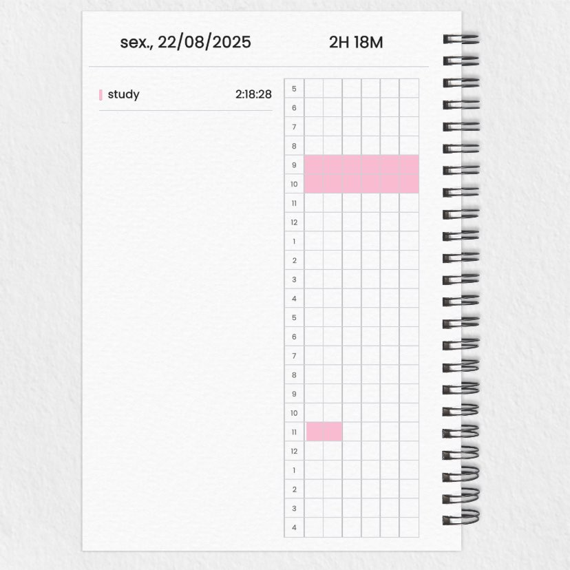
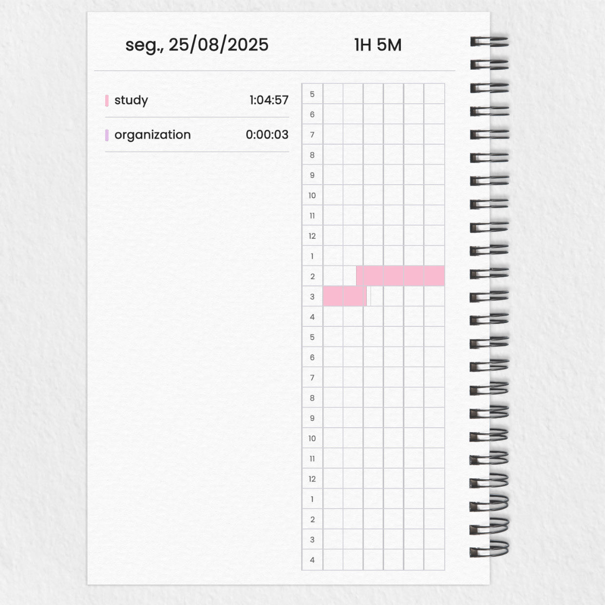
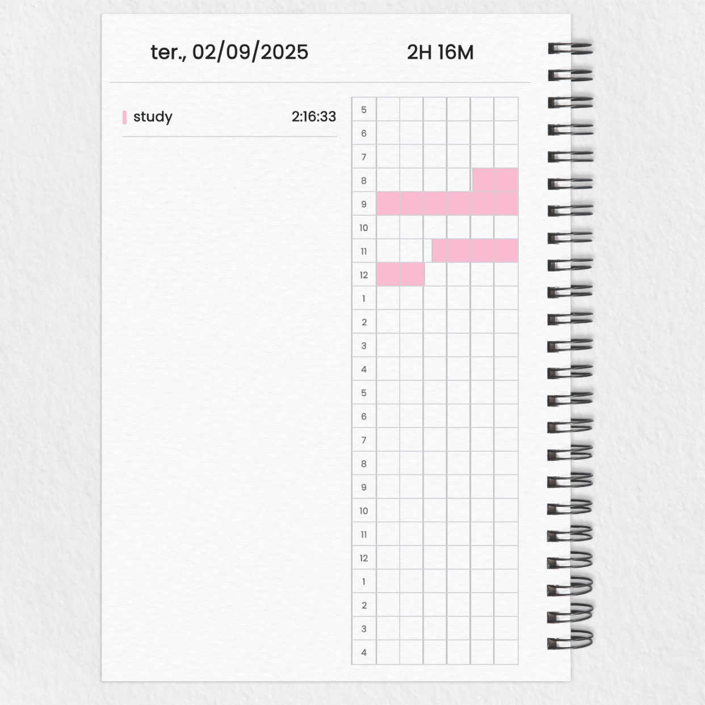
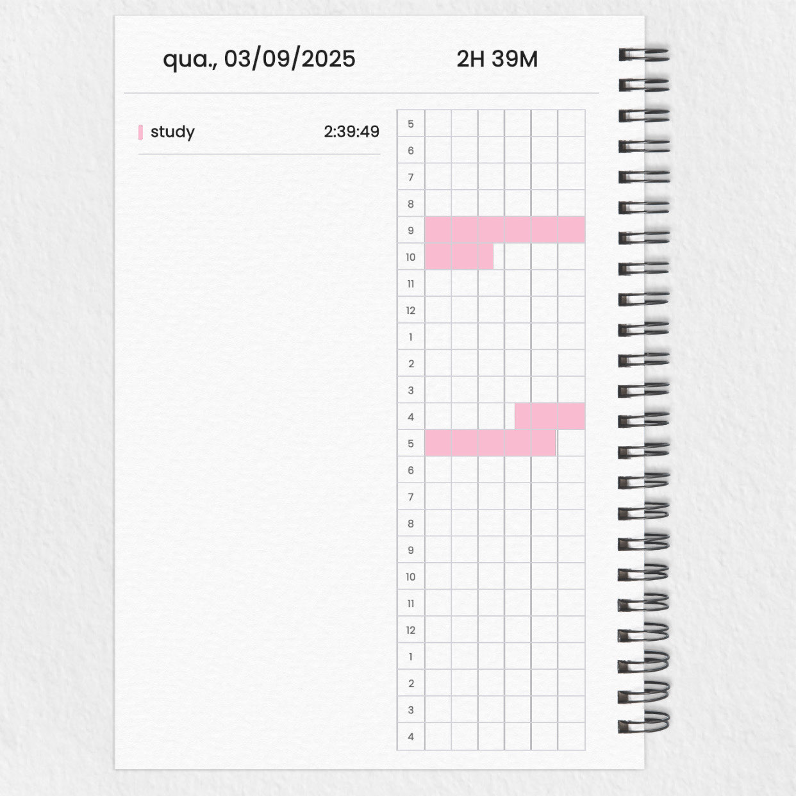
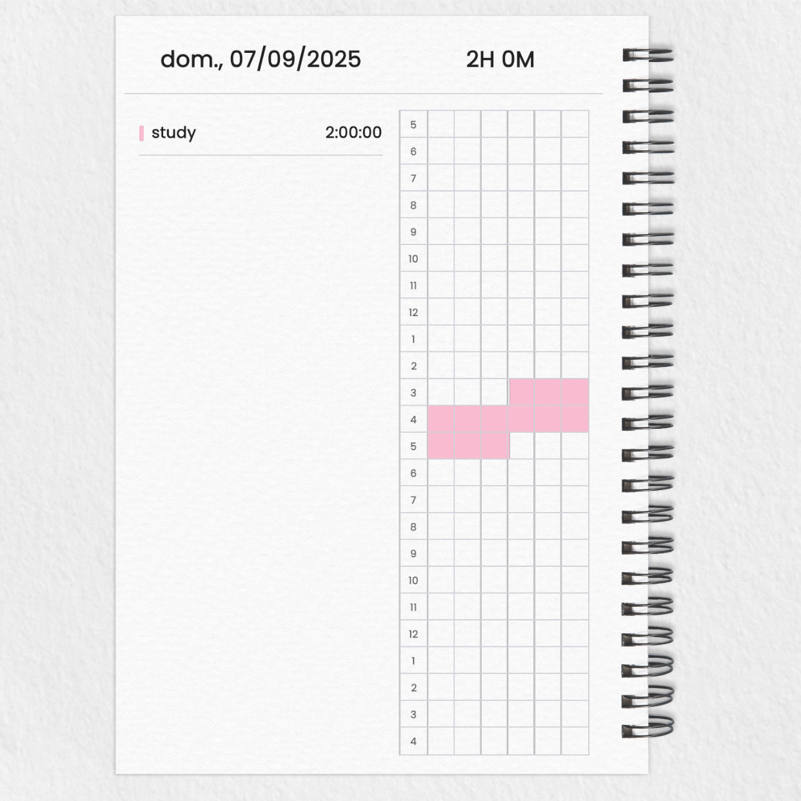
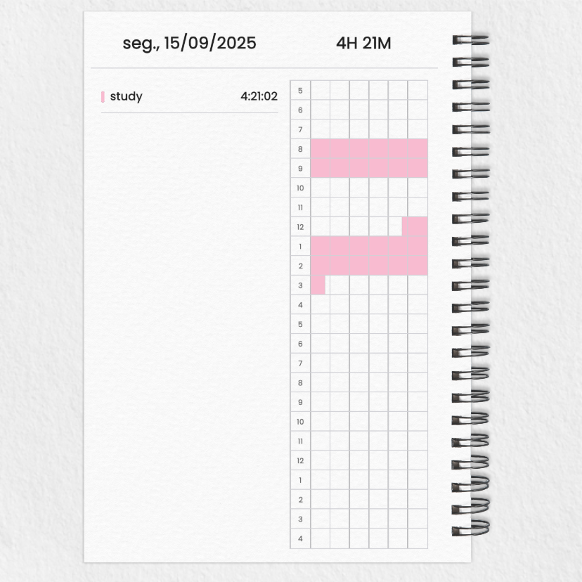

# study-log
studying doesn't suck as much as failing.  ⤷ study tracker

# 📚 Study Log – [Letícia Laguna]

> Registro público dos meus estudos, com prints do YPT e acompanhamento de progresso diário.

---

## 🗓 Objetivo
Manter consistência nos estudos, registrar horas e progresso para acompanhar minha evolução.

---

## 📊 Progresso

| Data       | Horas | Assunto / Tópico | Evidência |
|------------|-------|------------------|-----------|
| 11-08-2025 | 1h20  | Revisão de Lógica |  |
| 18-08-2025 | 0h48  | Revisão de Lógica |  |
| 19-08-2025 | 2h06  | Exercícios Faculdade |  |
| 22-08-2025 | 2h18  | Desenvovimento Mobile |  |
| 22-08-2025 | 1h05  | Prototipação |  |
| 02-09-2025 | 2h16  | Banco de Dados |  |
| 03-09-2025 | 2h39  | Banco de Dados e Aula |  |
| 07-09-2025 | 2h00  | Prototipação de App |  |
| 17-09-2025 | 4h21  | Aula e SQLServer |  |
---

> "Pequenos avanços diários levam a grandes resultados."
